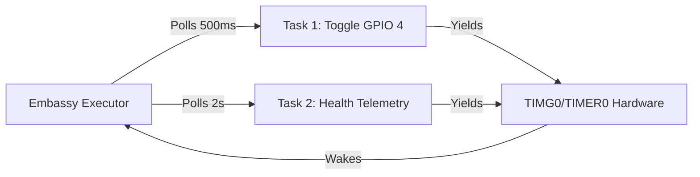

Case Study: Asynchronous Bare-Metal Firmware on ESP32-S3
System Architecture & Deployment Analysis

Author: Rohit Vijay Parab
Date: July 5, 2026

## Getting Started

### Prerequisites
- Rust with the ESP toolchain installed via `rustup`.
- `espflash` CLI tool: `cargo install espflash`

### Build & Run
The project requires the Xtensa linker to be in your PATH.

1. **Set the Toolchain Path** (ensure this matches your environment):
   ```bash
   export PATH="/Users/rohitparab/.rustup/toolchains/esp/xtensa-esp-elf/esp-15.2.0_20250920/xtensa-esp-elf/bin:$PATH"
   ```

2. **Build and Flash**:
   ```bash
   cargo +esp run --release
   ```
   This command compiles the code, flashes it to the device, and opens a serial monitor.

---

## System Topology & Architecture
   The application achieves true cooperative multi-tasking without an underlying operating system (like FreeRTOS or Linux). It relies on a hardware timer event loop to orchestrate execution contexts.


Operational Mechanisms
Cooperative Concurrency: When Timer::after(...).await is called, the task suspends execution and yields control back to the Embassy executor. The executor puts the CPU into a low-power state until TIMG0 issues a hardware interrupt indicating the timer has expired.

Memory Ownership ('static): The Output<'static> type signature guarantees that the background task holds exclusive, immutable ownership of the GPIO pin memory mapping for the entire lifetime of the runtime, preventing race conditions or null pointer references at the hardware layer.

## Technical Implementation Notes
This project requires special handling to make the binary bootable by the ESP32-S3's 2nd-stage bootloader:

- **Application Descriptor**: The `esp_app_desc!` macro in `src/main.rs` is mandatory to inject the correct metadata (magic number, efuse rev bounds, MMU settings).
- **Linker Script Override**: The `build.rs` script generates a custom `rodata.x` linker script at build time. This ensures that the `.flash.appdesc` section is placed at the very **start** of the page-aligned DROM segment (offset 0x20 from the segment start). If this section is not correctly placed at offset 0, the bootloader will fail to find the app descriptor and reject the partition as unbootable.

## Source Code Implementation
   Below is the production-grade, unblocked code architecture implemented in src/main.rs:

Rust
#![no_std]
#![no_main]

use embassy_executor::Spawner;
use embassy_time::{Duration, Timer};
use esp_backtrace as _;
use esp_hal::{
gpio::{Level, Output},
timer::timg::TimerGroup,
};
use esp_println::println;

// 1. CRITICAL RUNTIME METADATA INJECTION
// Injects standard ESP-IDF structure offsets directly into the raw machine binary.
// This satisfies the 2nd-stage bootloader check, preventing efuse mismatch panic-loops.
esp_bootloader_esp_idf::esp_app_desc!(
env!("CARGO_PKG_VERSION"),
env!("CARGO_PKG_NAME"),
"00:00:00",
"2024-01-01",
"0.0.0",
65536,
0,
65535,
0
);

// TASK 1: The Independent Heartbeat Engine
#[embassy_executor::task]
async fn heartbeat_task(mut led_pin: Output<'static>) {
loop {
led_pin.set_high();
Timer::after(Duration::from_millis(500)).await; // Non-blocking yield

        led_pin.set_low();
        Timer::after(Duration::from_millis(500)).await; // Non-blocking yield
    }
}

// THE MASTER MAIN ENTRYPOINT
#[esp_hal_embassy::main]
async fn main(spawner: Spawner) -> ! {
// A. Initialize system clocks and peripheral registers safely via unified HAL
let peripherals = esp_hal::init(esp_hal::Config::default());

    // B. Configure the asynchronous software timer groups using the 0.23.1 drivers
    let mut timg0 = TimerGroup::new(peripherals.TIMG0);
    
    // Disable hardware Watchdog Timer (WDT) to prevent reboot triggers during debugging
    timg0.wdt.disable();
    esp_hal_embassy::init(timg0.timer0);

    // C. Configure physical GPIO 4 as a digital output pin initialized low
    let led = Output::new(peripherals.GPIO4, Level::Low);

    println!("System Initialization Complete. Activating Async Tasks...");

    // D. Spawn the heartbeat task onto the background executor runtime loop
    match spawner.spawn(heartbeat_task(led)) {
        Ok(_) => println!("Heartbeat task spawned successfully!"),
        Err(_) => println!("CRITICAL: Failed to spawn heartbeat task!"),
    }

    // MAIN EXECUTION LOOP (Task 2: System Monitor running concurrently)
    let mut loop_counter = 0;
    loop {
        println!("System Monitor: Loop Tick #{}", loop_counter);
        loop_counter += 1;

        // Yield execution context for 2000 milliseconds
        Timer::after(Duration::from_secs(2)).await;
    }
}
## Root Cause Analysis (RCA) Ledger
   During development, the project halted at two critical error boundaries. Here is how they were systematically isolated and resolved:

Incident 1: The Boot-Loop Panic
Symptom: The console repeatedly threw E (95) boot_comm: Image requires efuse blk rev >= v292.31, but chip is v1.4 followed by Factory app partition is not bootable.

Root Cause: The board's factory-flashed 2nd-stage bootloader expects a highly specific struct definition header at the beginning of the application binary offset (0x10000). Pure no_std compilation outputs an optimized raw binary that lacks this header. The bootloader read garbage memory data, hit an invalid out-of-bounds config parsing block, and assumed the chip lacked the hardware capability to boot it.

Resolution: Integrated the esp-bootloader-esp-idf dependency and called esp_app_desc!() at the root of main.rs. This systematically injects the valid structural metadata array that the bootloader requires to safely parse and execute the app partition.

Incident 2: The Silent LED Fault
Symptom: Internal logic loops executed smoothly in the UART console, but a physical LED wired to Pin 4 remained unlit.

Root Cause: Software-Hardware separation. The logical state machines were operating correctly, but current flow was blocked at the physical layer.

Resolution Plan Executed:

Isolated Software: Monitored serial lines to verify the runtime environment wasn't locked or crashing.

Isolated Hardware Components: Conducted a 3.3V Sanity Test by mapping the jumper wire directly to the 3V3 power rail to verify LED orientation (Anode/Cathode alignment) and loop resistor integrity.

## Key Takeaways for SRE & Systems Engineering
   Observable Infrastructure at the Edge: Without standard Unix runtime hooks (/proc, syslog), firmware observability must be intentionally architected. The combination of esp-backtrace and UART printing acts as the infrastructure's telemetry engine.

Linker Control: Compiling for target architectures like xtensa-esp32s3-none-elf shifts ownership of memory segmentation layout entirely to .cargo/config.toml flags (e.g., -C link-arg=-Tlinkall.x and -C linker=rust-lld).

Deterministic Resource Allocation: Utilizing an async engine like Embassy allows for highly deterministic timing behaviors and robust concurrent execution tracks without the high resource overhead, scheduling latency, and thrashing context-switches associated with traditional kernel-level threads.

Would you like to extend this documentation to layout a schematic blueprint for adding your next hardware peripheral, such as an I2C sensor or a Wi-Fi monitoring stack?

